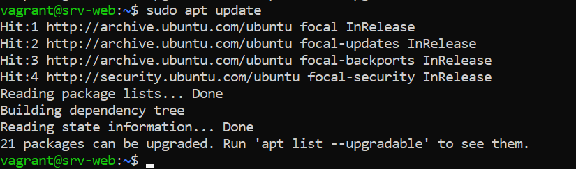
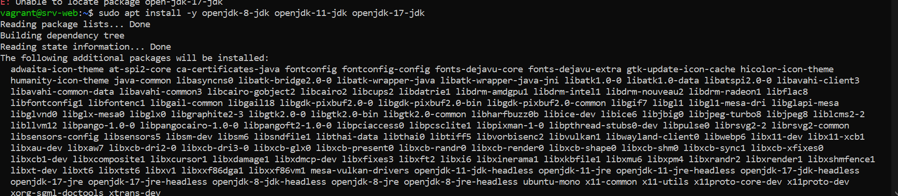
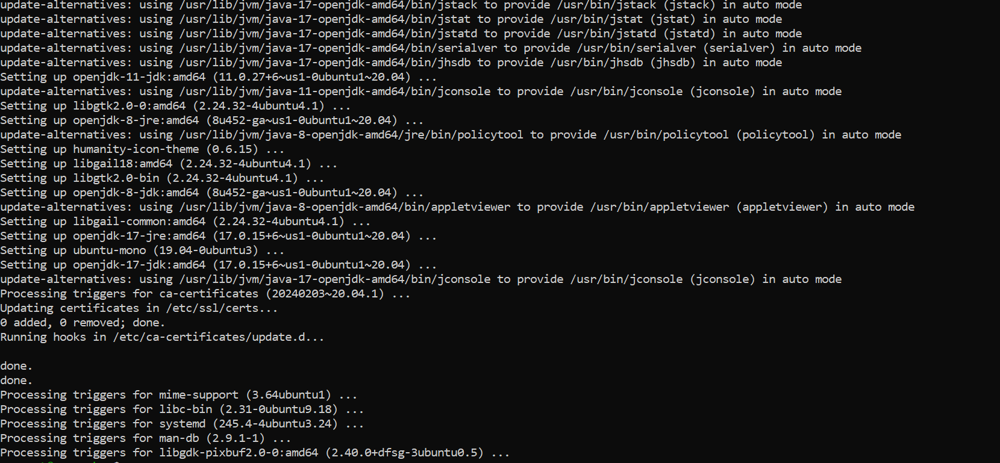
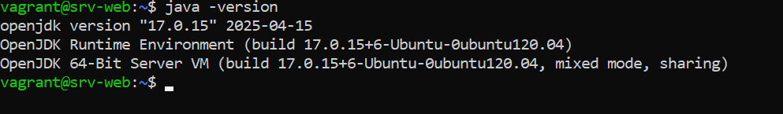
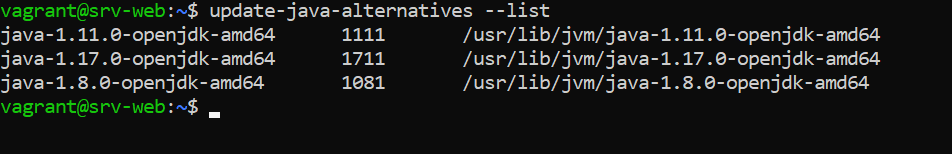
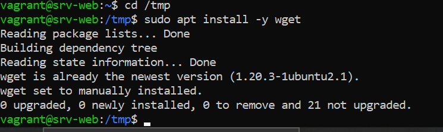
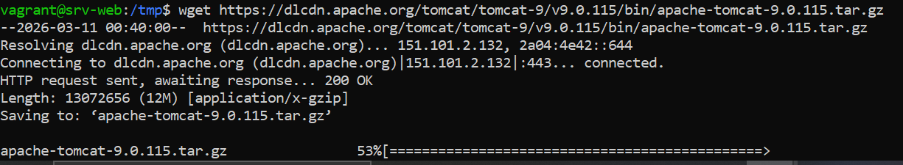
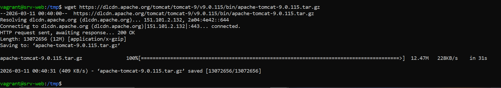
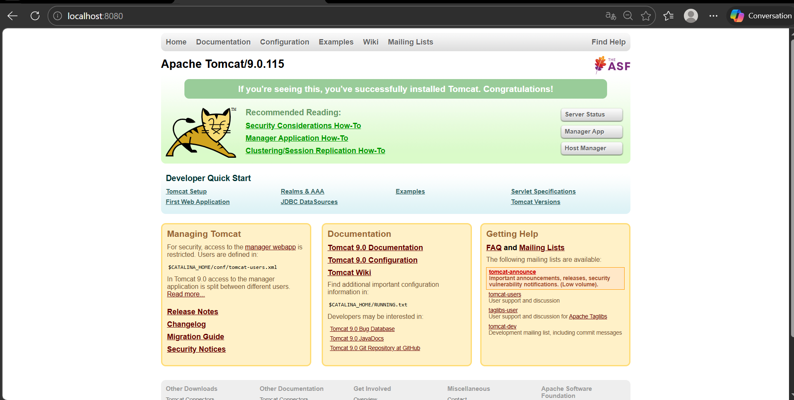
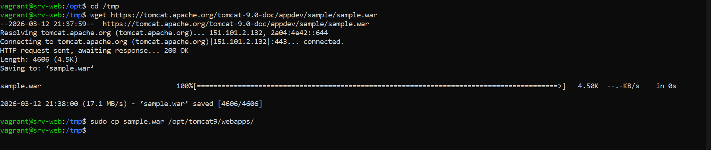

#  TP — Déploiement Web Java : Vagrant + Tomcat 9


> Création d'une VM Ubuntu avec Vagrant, installation multi-version JDK, déploiement de Tomcat 9 et d'une application Java Web, gestion automatisée via un script interactif.


---


---

##  Structure du projet

```
tp1/
├── Vagrantfile                 ← Configuration de la VM
├── README.md                   ← Ce fichier
├── deploy.sh                   ← Script de gestion Tomcat
├── springApp/
│   ├── index.jsp               ← Page principale de l'app
│   └── WEB-INF/
│       └── web.xml             ← Descripteur de déploiement
└── screenshots/
    ├── 01_vagrant_up.png
    ├── 02_vagrant_status.png
    ├── 03_ssh_connexion.png
    ├── 04_apt_update.png
    ├── 05_jdk8_install.png
    ├── 06_jdk11_install.png
    ├── 07_jdk17_install.png
    ├── 08_java_alternatives.png
    ├── 09_tomcat_download.png
    ├── 10_tomcat_status.png
    ├── 11_tomcat_browser.png
    ├── 12_webapps_deploy.png
    ├── 13_app_browser.png
    ├── 14_deploy_menu.png
    ├── 15_stop_tomcat.png
    ├── 16_restart_tomcat.png
    └── 17_deploy_war.png
```

---

## Démarrage rapide

```bash
 1. Cloner le dépôt

cd tp1

 2. Démarrer la VM (provisionne automatiquement Java + Tomcat)
vagrant up

 3. Se connecter
vagrant ssh srv-web

 4. Lancer le script de gestion
sudo /opt/tomcat9/deploy.sh
```

Application disponible sur : **http://localhost:8080/myapp**

---

## Création de la VM Vagrant

### Initialisation

```bash
mkdir tp1 && cd tp1
vagrant init
```

### Vagrantfile

```ruby
Vagrant.configure("2") do |config|
  config.vm.box = "ubuntu/focal64"
  config.vm.hostname = "srv-web"

  # Réseau
  config.vm.network "private_network", ip: "192.168.56.10"
  config.vm.network "forwarded_port", guest: 8080, host: 8080

  # VM resources
  config.vm.provider "virtualbox" do |vb|
    vb.memory = "2048"
    vb.cpus = 2
  end

  # Dossier partagé pour le WAR
  config.vm.synced_folder "./springApp", "/vagrant/springApp"
  # Provisioning : installer Java, Maven et Tomcat
  config.vm.provision "shell", inline: <<-SHELL
    sudo apt update
    sudo apt install -y openjdk-8-jdk openjdk-11-jdk openjdk-17-jdk maven wget tar

    # Installer Tomcat
    cd /opt
    if [ ! -d "tomcat9" ]; then
      wget https://archive.apache.org/dist/tomcat/tomcat-9/v9.0.115/bin/apache-tomcat-9.0.115.tar.gz
      tar -xvzf apache-tomcat-9.0.115.tar.gz
      mv apache-tomcat-9.0.115 tomcat9
      chmod +x tomcat9/bin/*.sh
    fi

    # Copier le WAR automatiquement si présent
    if [ -f /home/vagrant/shared/springApp-1.0.war ]; then
      cp /home/vagrant/shared/springApp-1.0.war /opt/tomcat9/webapps/
    fi
  SHELL
end

```

### Démarrage

```bash
vagrant up
vagrant status


##  Partie 2 — Connexion SSH

```bash
vagrant ssh srv-web
# vagrant@srv-web:~$
```

Mise à jour du système :

|  | Connexion SSH — prompt `vagrant@srv-web` |


---

## Installation des JDK 8, 11, 17

### Installation


|  | Connexion SSH — prompt `vagrant@srv-web` |
|  | Connexion SSH — prompt `vagrant@srv-web` |


### Gestion des versions

|  | Connexion SSH — prompt `vagrant@srv-web` |
|  | Connexion SSH — prompt `vagrant@srv-web` |


##  Installation de Tomcat 9

### Téléchargement et extraction

|  | Connexion SSH — prompt `vagrant@srv-web` |
|  | Connexion SSH — prompt `vagrant@srv-web` |
|  | Connexion SSH — prompt `vagrant@srv-web` |


### Vérification

```
http://localhost:8080
```
|  | Connexion SSH — prompt `vagrant@srv-web` |

---

##   Déploiement de l'Application Java

### Créer le WAR

|  | Connexion SSH — prompt `vagrant@srv-web` |


### Déployer dans Tomcat

```bash
sudo cp /tmp/myapp.war /opt/tomcat9/webapps/
ls /opt/tomcat9/webapps/
# myapp/   myapp.war   ROOT/ ...
```

> **Hot deploy** : Tomcat détecte automatiquement le WAR et le déploie sans redémarrage.

### Tester

```bash
curl http://localhost:8080
# ou : http://192.168.56.10:8080/myapp/
```


|  | Répertoire `webapps/` après déploiement |
|  | Application accessible dans le navigateur |

---

## Partie 6 — Script deploy.sh

### Fonctionnalités

| Option | Action |
|--------|--------|
| `1` | Démarrer Tomcat |
| `2` | Arrêter Tomcat |
| `3` | Redémarrer Tomcat |
| `4` | Voir le statut |
| `5` | Déployer un fichier WAR |
| `6` | Supprimer une application |
| `7` | Afficher les logs (catalina.out) |
| `8` | Lister les applications déployées |
| `0` | Quitter |

### Code source — `deploy.sh`

```bash
#!/bin/bash
# deploy.sh — Gestion de Tomcat 9 (menu interactif)

RED='\033[0;31m'; GREEN='\033[0;32m'; YELLOW='\033[1;33m'
BLUE='\033[0;34m'; CYAN='\033[0;36m'; BOLD='\033[1m'; RESET='\033[0m'

TOMCAT_HOME="/opt/tomcat9"
WEBAPPS="$TOMCAT_HOME/webapps"
LOGS="$TOMCAT_HOME/logs/catalina.out"
SERVICE="tomcat"

print_header() {
  clear
  echo -e "${BLUE}${BOLD}"
  echo "  ╔══════════════════════════════════════════╗"
  echo "  ║      🐱  GESTION TOMCAT 9 — MENU         ║"
  echo "  ║         srv-web · 192.168.56.10           ║"
  echo "  ╚══════════════════════════════════════════╝"
  echo -e "${RESET}"
}

get_status() {
  if systemctl is-active --quiet $SERVICE; then
    echo -e "  État : ${GREEN}●  EN COURS D'EXÉCUTION${RESET}"
  else
    echo -e "  État : ${RED}●  ARRÊTÉ${RESET}"
  fi
  echo ""
}

start_tomcat()   { sudo systemctl start   $SERVICE && echo -e "${GREEN}✅ Tomcat démarré.${RESET}"; }
stop_tomcat()    { sudo systemctl stop    $SERVICE && echo -e "${GREEN}✅ Tomcat arrêté.${RESET}"; }
restart_tomcat() { sudo systemctl restart $SERVICE && echo -e "${GREEN}✅ Tomcat redémarré.${RESET}"; }
status_tomcat()  { sudo systemctl status  $SERVICE --no-pager; }

deploy_war() {
  read -rp "  Chemin du WAR : " WAR_PATH
  [ ! -f "$WAR_PATH" ] && echo -e "${RED}❌ Fichier introuvable.${RESET}" && return
  WAR_NAME=$(basename "$WAR_PATH")
  APP_NAME="${WAR_NAME%.war}"
  sudo cp "$WAR_PATH" "$WEBAPPS/" && sudo chown root:root "$WEBAPPS/$WAR_NAME"
  echo -e "${GREEN}✅ WAR déployé : http://localhost:8080/$APP_NAME${RESET}"
}

undeploy_app() {
  ls "$WEBAPPS" | grep -v 'ROOT\|manager\|host-manager\|examples\|docs'
  read -rp "  Nom de l'app à supprimer : " APP_NAME
  sudo rm -rf "$WEBAPPS/$APP_NAME" "$WEBAPPS/${APP_NAME}.war"
  echo -e "${GREEN}✅ '$APP_NAME' supprimée.${RESET}"
}

show_logs()  { sudo tail -n 50 "$LOGS"; }
list_apps()  { for d in "$WEBAPPS"/*/; do echo "  ▶  $(basename $d)  →  http://192.168.56.10:8080/$(basename $d)"; done; }

while true; do
  print_header; get_status
  echo -e "  ${GREEN}1)${RESET} Démarrer   ${RED}2)${RESET} Arrêter   ${YELLOW}3)${RESET} Redémarrer"
  echo -e "  ${CYAN}4)${RESET} Statut     ${CYAN}5)${RESET} Déployer  ${CYAN}6)${RESET} Supprimer"
  echo -e "  ${CYAN}7)${RESET} Logs       ${CYAN}8)${RESET} Lister    ${RED}0)${RESET} Quitter"
  echo ""
  read -rp "  Votre choix [0-8] : " CHOICE
  echo ""
  case $CHOICE in
    1) start_tomcat ;;    2) stop_tomcat ;;     3) restart_tomcat ;;
    4) status_tomcat ;;   5) deploy_war ;;      6) undeploy_app ;;
    7) show_logs ;;       8) list_apps ;;       0) echo -e "${GREEN}Au revoir !${RESET}"; exit 0 ;;
    *) echo -e "${RED}❌ Option invalide.${RESET}" ;;
  esac
  read -rp "  [Entrée] pour continuer..."
done
```

### Installation

```bash
sudo nano /opt/tomcat9/deploy.sh
# (coller le contenu ci-dessus)
sudo chmod +x /opt/tomcat9/deploy.sh
sudo /opt/tomcat9/deploy.sh
```

| Capture | Description |
|---------|-------------|
|  | Menu principal du script |
|  | Option 2 — Arrêt de Tomcat |
|  | Option 3 — Redémarrage de Tomcat |
|  | Option 5 — Déploiement d'un WAR |

---

## ✅ Résultat final

| Composant | Valeur |
|-----------|--------|
| VM | `srv-web` — Ubuntu 20.04 LTS |
| Adresse IP | `192.168.56.10` |
| Ressources | 2 Go RAM — 2 vCPUs |
| JDK 8 | `/usr/lib/jvm/java-8-openjdk-amd64` |
| JDK 11 ✅ | `/usr/lib/jvm/java-11-openjdk-amd64` (actif) |
| JDK 17 | `/usr/lib/jvm/java-17-openjdk-amd64` |
| Tomcat 9 | `/opt/tomcat9` — port `8080` |
| Application | `http://192.168.56.10:8080/myapp` |
| Script | `/opt/tomcat9/deploy.sh` |

---

## 🛠️ Commandes utiles

```bash
# Vagrant
vagrant up              # Démarrer la VM
vagrant halt            # Éteindre la VM
vagrant ssh srv-web     # Connexion SSH
vagrant reload          # Redémarrer la VM
vagrant destroy -f      # Supprimer la VM

# Tomcat
sudo systemctl start tomcat
sudo systemctl stop tomcat
sudo systemctl status tomcat
sudo tail -f /opt/tomcat9/logs/catalina.out

# Java
java -version
sudo update-alternatives --config java

# Déploiement
sudo cp monapp.war /opt/tomcat9/webapps/
ls /opt/tomcat9/webapps/
```

---

## 📄 Licence

Distribué sous licence MIT. Voir le fichier `LICENSE` pour plus d'informations.

---

*TP réalisé dans le cadre du cours DevOps / Administration Système*
